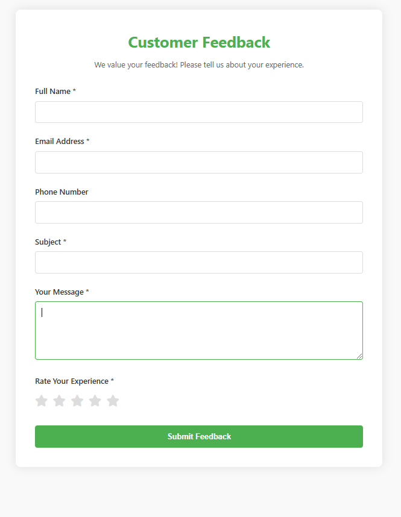

# Customer Feedback Form

A simple and lightweight customer feedback system built with PHP and MySQL that allows businesses to collect customer experiences and ratings.




## Features

- Simple and clean interface
- Required field validation
- Star rating system
- Success message display
- Data stored in MySQL database
- Email format validation
- Optional phone number field

## Technologies Used

- HTML for structure
- PHP for server-side processing
- MySQL for data storage
- JavaScript for form validation
- CSS for styling
- XAMPP for local development

## Project Structure

```
customer-feedback/
├── index.php
├── insertdata.php
├── connection.php
├── README.md
└── assets/
    ├── css/
    │   └── style.css
    └── js/
        └── script.js
```

## Installation

1. Install XAMPP on your computer
2. Clone this repository to your XAMPP's htdocs folder:
```bash
cd C:/xampp/htdocs
git clone https://github.com/your-username/customer-feedback.git
```

3. Start XAMPP and ensure Apache and MySQL services are running
4. Create a new database in phpMyAdmin:
```sql
CREATE DATABASE feedback_db;
```

5. The table will be automatically created when you first run the application

## Database Structure

The feedback_db database contains a single table:
```sql
CREATE TABLE customer_feedback (
    id INT(11) AUTO_INCREMENT PRIMARY KEY,
    name VARCHAR(100) NOT NULL,
    email VARCHAR(100) NOT NULL,
    phone VARCHAR(20),
    subject VARCHAR(200) NOT NULL,
    message TEXT NOT NULL,
    rating INT(1) NOT NULL,
    created_at TIMESTAMP DEFAULT CURRENT_TIMESTAMP
);
```

## Usage

1. Access the form through your web browser:
```
http://localhost/customer-feedback/
```

2. Fill in the required fields:
   - Full Name
   - Email Address
   - Subject
   - Message
   - Rating

3. Submit your feedback

## Form Validation

- Name field is required
- Email must be in valid format
- Subject is required
- Message is required
- Rating must be selected (1-5 stars)
- Phone number is optional

## Contributing

1. Fork the repository
2. Create your feature branch:
```bash
git checkout -b feature/YourFeature
```
3. Commit your changes:
```bash
git commit -m 'Add some feature'
```
4. Push to the branch:
```bash
git push origin feature/YourFeature
```
5. Submit a pull request

## Requirements

- PHP 7.0 or higher
- MySQL 5.6 or higher
- XAMPP (or similar local server environment)
- Web browser with JavaScript enabled

## Known Issues

- No input sanitization for phone numbers
- Basic client-side validation only
- No CSRF protection implemented

---

For support, create an issue in the repository.